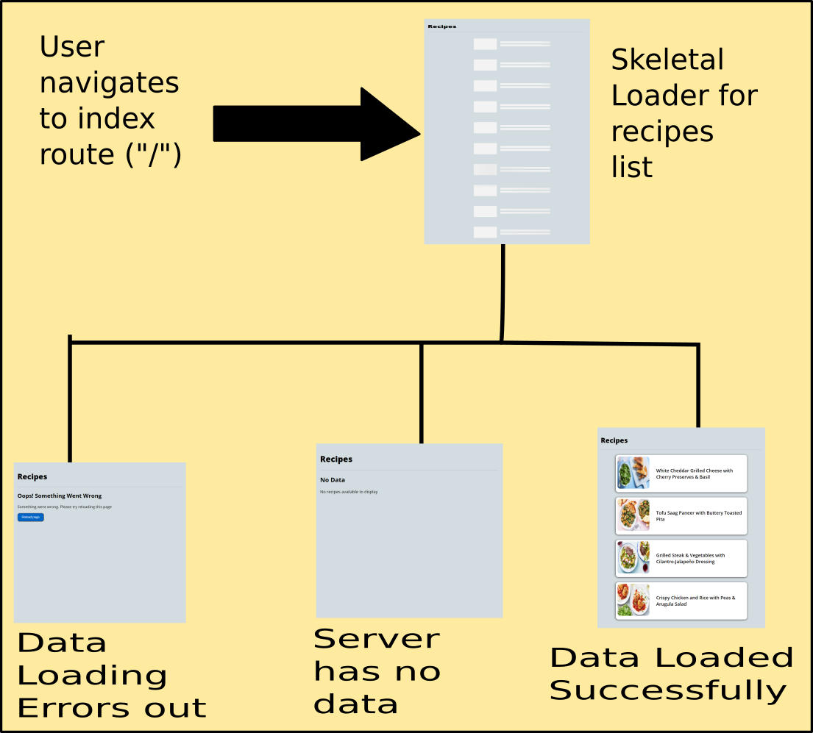
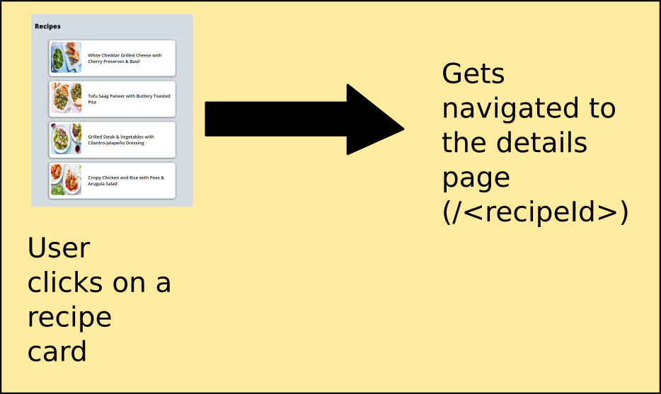
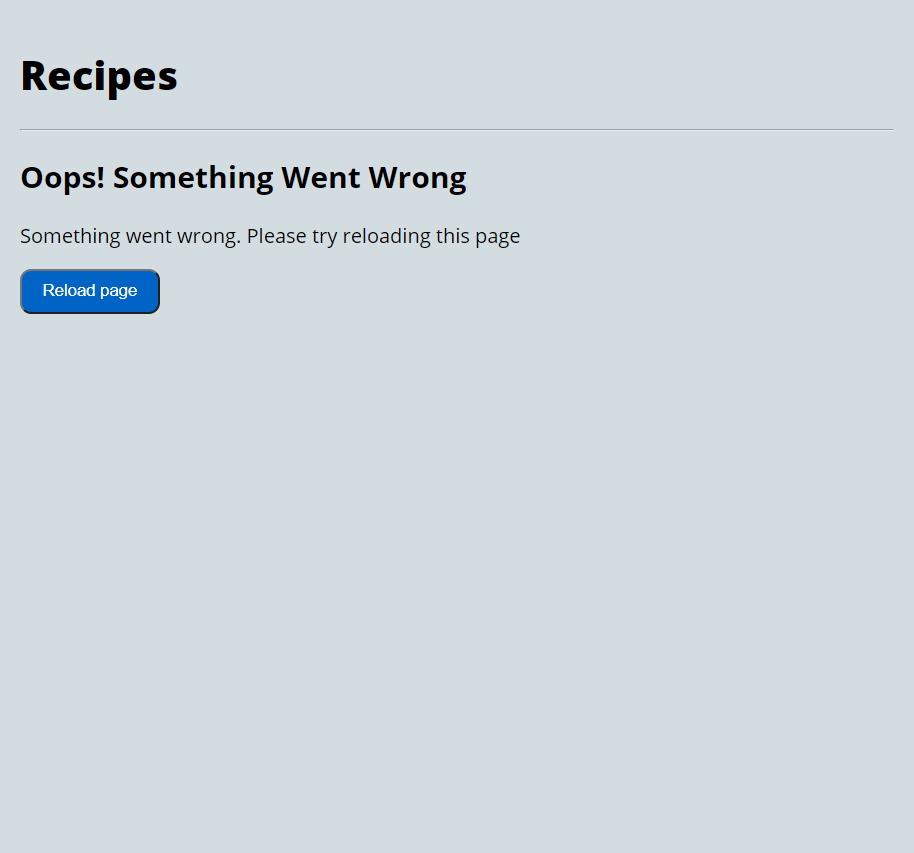
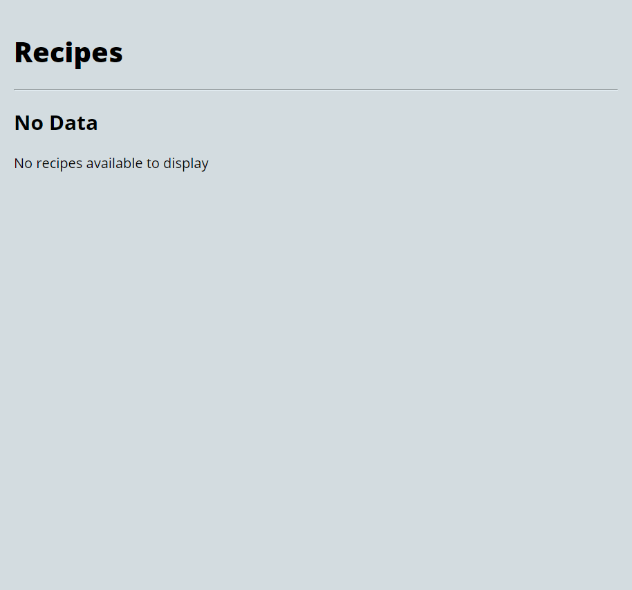

## Steps to Run Locally

- Clone this repository

```bash
git clone git@github.com:Parthipan-Natkunam/recipes.git
#or
git clone https://github.com/Parthipan-Natkunam/recipes.git
```

- `cd` into the cloned directory

```bash
cd recipes
```

- Install dependencies

```bash
npm i
#or
yarn install
```

- Create a file named `.env.local`

```bash
touch .env.local
```

- Add the following entries to the `.env.local` file.

```bash
NEXT_PUBLIC_CONTENTFUL_TOKEN=<Your Access Token Here>
NEXT_PUBLIC_CONTENTFUL_SPACE=<Your Space Id>
NEXT_PUBLIC_CONTENTFUL_ENV=<Your Contentful ENV name>
```

- Run the development server:

```bash
npm run dev
# or
yarn dev
```

- Open [http://localhost:3000](http://localhost:3000) with your browser to see the result.

## Steps to Run Unit Tests

```bash
npm run test:unit
#or
yarn test:unit
```

The script `test:unit-watch` can be used to run the unit tests in watch mode.

## Application Screenshots

##### Recipes List View


##### Recipe Details View


## Application Architecture & Decisions

The application has 2 routes:

1. `List View` : The index route - `/` (localhost:300/) => lists all recipes with image and title in a card format.
2. `Details View` : The details route - `/<recipeId>` (localhost:300/recipeId) => provide some detailed information about a specific recipe.

#### Rendering Strategy

##### List View

- The page wrapper with page heading is `static-rendered`, while the recipe list uses `client-side rendering` after rehydration.
- This strategy was adopted so in case of a large dataset, the loading, error, skeltal loader and future pagination implementations could be done with ease purely on the client-side.
- The con is reduced SEO, which could be handled with an advanced startaegy like loading page through puppeteer for search engine bots.

###### Control Flow:

- Data Loading Flow
  

- Recipe Detail Navigation Flow
  

##### Details View

- This view is `server-side rendered`.
- This strategy was adopted as it gives a higher SEO results with little efforts.
- Also, the data is to be loaded only for a single recipe, hence server side rendering on-demand will be an efficient way to render this page rather than client side rendering.
- The transition between these two views in aided by a `page-wide loader`.
- `React Markdown` is used to parse the description data to support rich-text rendering.


##### Common Edge Cases for Both Views:

- Network Data Load Error:
  

- Data not available:
  

## Future Improvements

- Implement pagination (or an infinite scroll behaviour for the recipes list view) [can be done by passing limit and skip arguments to the query incombination with a local component level state].

- Implement the ability to search recipe by name.

- Implement ability to filter recipe by tags and chef.

- Improve unit test coverage.

- add cypress integration tests.

- refactor the list view to have a similar code quality as `[id].tsx` route (eliminate multiple ifs and returns pattern in that page)

- Add proper open-graph meta tags in header for better SEO results.
