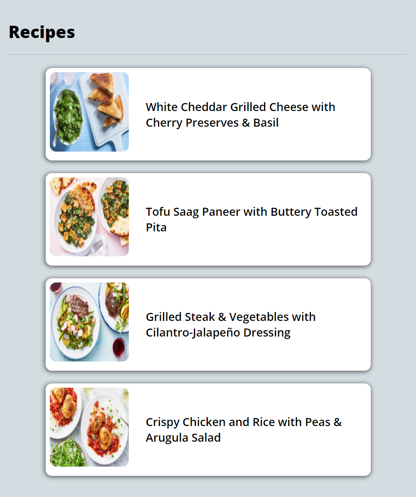
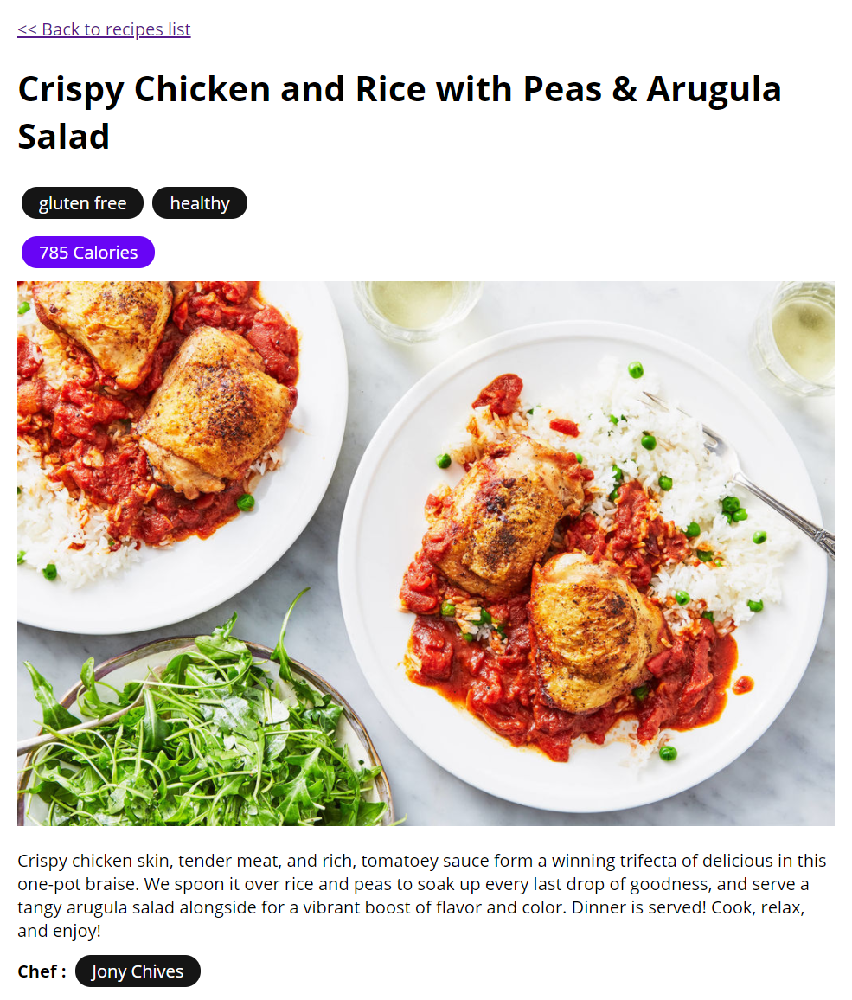

## Steps to Run Locally

- Clone this repository

```bash
git clone git@github.com:Parthipan-Natkunam/recipes.git
#or
git clone https://github.com/Parthipan-Natkunam/recipes.git
```

- `cd` into the cloned directory

```bash
cd recipes
```

- Install dependencies

```bash
npm i
#or
yarn install
```

- Create a file named `.env.local`

```bash
touch .env.local
```

- Add the following entries to the `.env.local` file.

```bash
NEXT_PUBLIC_CONTENTFUL_TOKEN=<Your Access Token Here>
NEXT_PUBLIC_CONTENTFUL_SPACE=<Your Space Id>
NEXT_PUBLIC_CONTENTFUL_ENV=<Your Contentful ENV name>
```

- Run the development server:

```bash
npm run dev
# or
yarn dev
```

- Open [http://localhost:3000](http://localhost:3000) with your browser to see the result.

## Steps to Run Unit Tests

```bash
npm run test:unit
#or
yarn test:unit
```

The script `test:unit-watch` can be used to run the unit tests in watch mode.

## Application Screenshots

##### Recipes List View



##### Recipe Details View



##### Application Workflow Gif


## Application Architecture & Decisions

## Future Improvements
